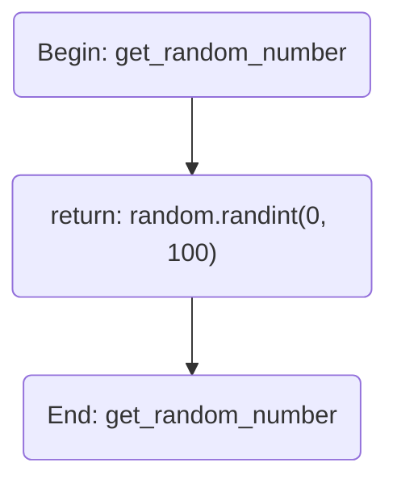
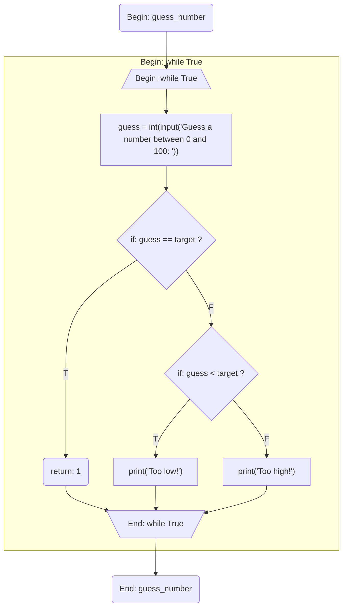
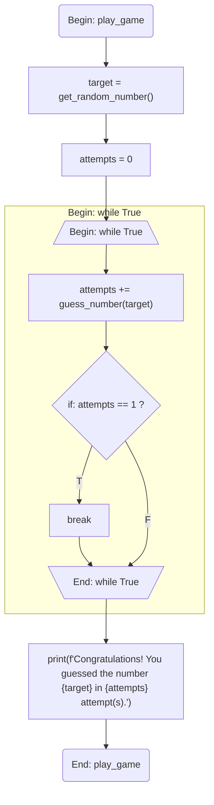

# Python to Mermaid converter

Convert your python module into a Markdown file with Mermaid flowcharts of containing functions.

# Install

There's no pre-built package yet. However you can install it with cargo easily:

```
cargo install python-to-mermaid
```

# Usage

This is very simple program that takes a python file as a stdin and outputs a markdown file.

```
python-to-mermaid < python_file.py > output.md
```

# Example

Given the following python code:

```python
import random

def get_random_number():
    return random.randint(0, 100)

def guess_number(target):
    while True:
        guess = int(input("Guess a number between 0 and 100: "))
        if guess == target:
            return 1
        elif guess < target:
            print("Too low!")
        else:
            print("Too high!")

def play_game():
    target = get_random_number()
    attempts = 0
    while True:
        attempts += guess_number(target)
        if attempts == 1:
            break
    print(f"Congratulations! You guessed the number {target} in {attempts} attempt(s).")

play_game()
```

The following markdown file will be generated:

````markdown
## `get_random_number`



## `guess_number`



## `play_game`


````
